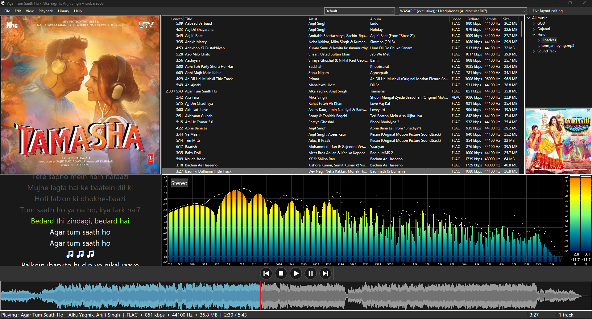

# 🎵 foobar2000 64-bit Column UI Theme

A fully customized **foobar2000 v2.x (64-bit)** layout built using **Columns UI** and several modern components. This theme includes a clean layout, waveform seekbar, spectrum visualizer, artwork display, metadata tools, and WASAPI output. All required components and configuration files are included in this repository.

---

## 📸 Screenshots



---

## ✨ Features
- Columns UI layout with playlist, artwork, metadata, and controls  
- Waveform minibar seekbar  
- Spectrum Analyzer visualizer  
- Artwork panel with fallback  
- MusicBrainz metadata tools  
- JScript Panel 3 custom scripting  
- WASAPI output  
- 100% compatible with foobar2000 64-bit

---

## 🧩 Included Components (stored in `/components`)
- `foo_vis_spectrum_analyzer.fb2k-component` — Spectrum Analyzer  
- `foo_wave_minibar_mod.fb2k-component` — Waveform Seekbar  
- `foo_artwork-1531.fb2k-component` — Artwork Panel  
- `foo_jscript_panel3-3.4.34.fb2k-component` — JScript Panel 3  
- `foo_musicbrainz-v0.5.0.fb2k-component` — MusicBrainz Tagger  
- `foo_out_wasapic.fb2k-component` — WASAPI Output  
- `foo_ui_columns-3.1.4.x86-x64.fb2k-component` — Columns UI

---

## 📂 Folder Structure
```
foobar2000-64bit-column-ui-theme/
│
├── README.md
├── components/
│   ├── foo_vis_spectrum_analyzer.fb2k-component
│   ├── foo_wave_minibar_mod.fb2k-component
│   ├── foo_artwork-1531.fb2k-component
│   ├── foo_jscript_panel3-3.4.34.fb2k-component
│   ├── foo_musicbrainz-v0.5.0.fb2k-component
│   ├── foo_out_wasapic.fb2k-component
│   └── foo_ui_columns-3.1.4.x86-x64.fb2k-component
│
├── config/
│   └── ColomnUiConfiguration.fcl
│
└── screenshots/
    ├── preview1.png
    └── preview2.gif
```

---

## 🚀 Installation
**1. Install foobar2000 64-bit**  
Download from foobar2000.org.

**2. Install components**  
Copy everything from `/components` into foobar2000 or install via:  
`File → Preferences → Components → Install…`

**3. Import the Columns UI layout**  
`Preferences → Display → Columns UI → Import`  
Load the included `.fcl` file (if you add one).

**4. Restart foobar2000**  
Your custom theme will load.

---

## 🛠️ Customization
- Column UI Editor: `Preferences → Display → Columns UI → Layout`  
- JScript Panel Scripts: `Preferences → Display → JScript Panel 3`


---

## 🤝 Credits
- foobar2000 — Peter Pawlowski  
- Columns UI  
- JScript Panel 3  
- MusicBrainz plugin  
- Waveform Minibar Mod  
- Spectrum Analyzer Visualizer

## ⭐ If you like this theme, please star the repository!
